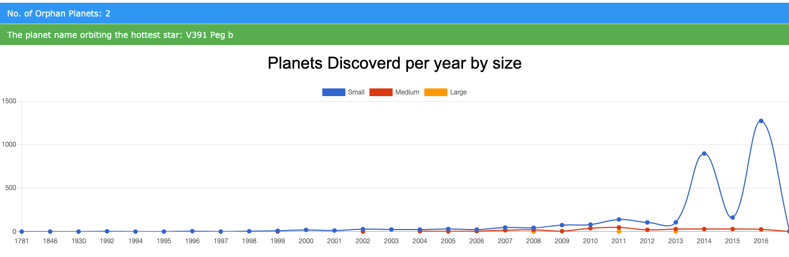
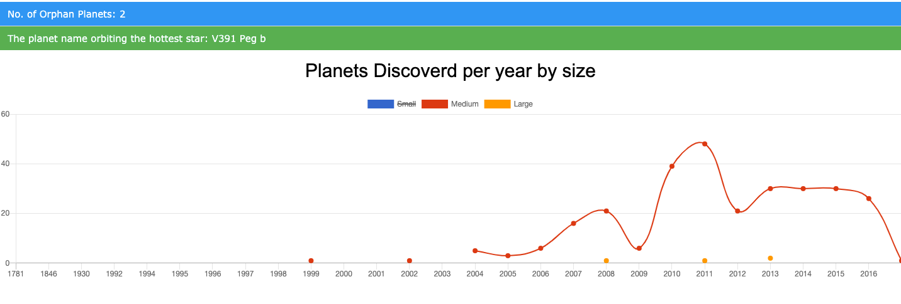

# Discover Exoplanet

### Synopsis
Discovery of Exoplanet based on size

### Prerequisites
Your system should be installed with latest version `ruby 2.7.0`

Then, install bundler by following command


```sh
gem install bundler
```

### Instructions

Execute below commands

1. `git clone https://github.com/loganathan-rs/discover-exoplanet.git`
2. `bundle install`
3. `bundle exec rackup`
4. Head over to `localhost:9292`

### Run Unit Tests

Ensure gems required for Testing by `bundle install` before running tests.

Execute below command to run all test expectations 

```sh
bundle exec rspec -f d`
```

### Screenshots

## All Planets



## Medium and Large Planets


